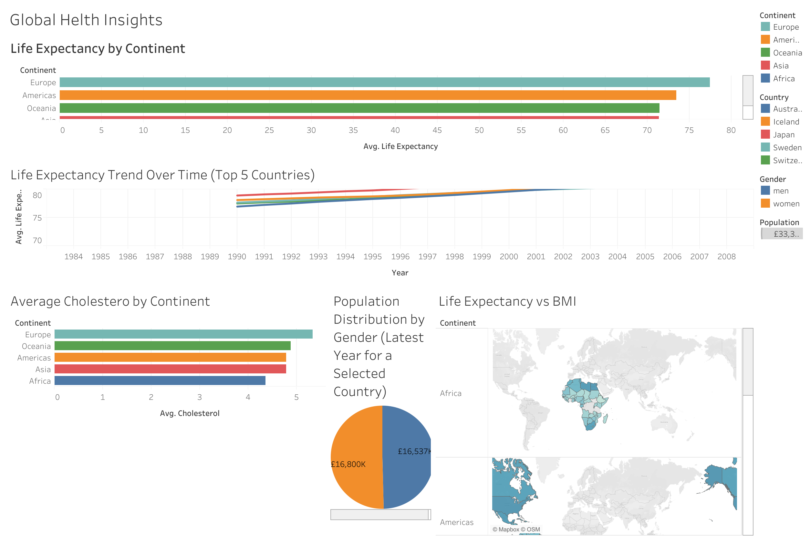

# 🌍 Global Health Insights

## 📌 Project Overview

This Tableau dashboard analyses global health indicators across different continents and countries. The project explores life expectancy, cholesterol levels, BMI, population distribution, and health trends over time using interactive visualisations.

---

## 🎯 Objectives

- Compare life expectancy across continents.
- Analyse health trends over time.
- Explore cholesterol levels by continent.
- Visualise BMI across different regions.
- Create an interactive dashboard using Tableau.

---

## 🛠 Tools Used

- Tableau
- Interactive Dashboards
- Maps
- Filters
- Calculated Fields
- Charts
- Data Visualisation

---

## 💡 Key Findings

- Europe has the highest average life expectancy.
- Africa has the lowest life expectancy.
- Cholesterol levels differ across continents.
- Population distribution varies between men and women.
- Interactive filters allow users to explore different countries.

---

## 📂 Project Files

- Tableau Workbook (.twbx)
- Dashboard Screenshot

---

## 🚀 Skills Demonstrated

- Data Analysis
- Dashboard Design
- Data Visualisation
- Interactive Filters
- Geographic Mapping
- Trend Analysis
- Storytelling with Data

---

# 📊 Dashboard Preview

### Global Health Dashboard

